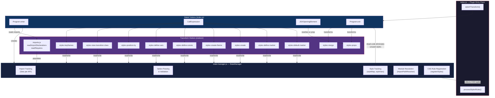
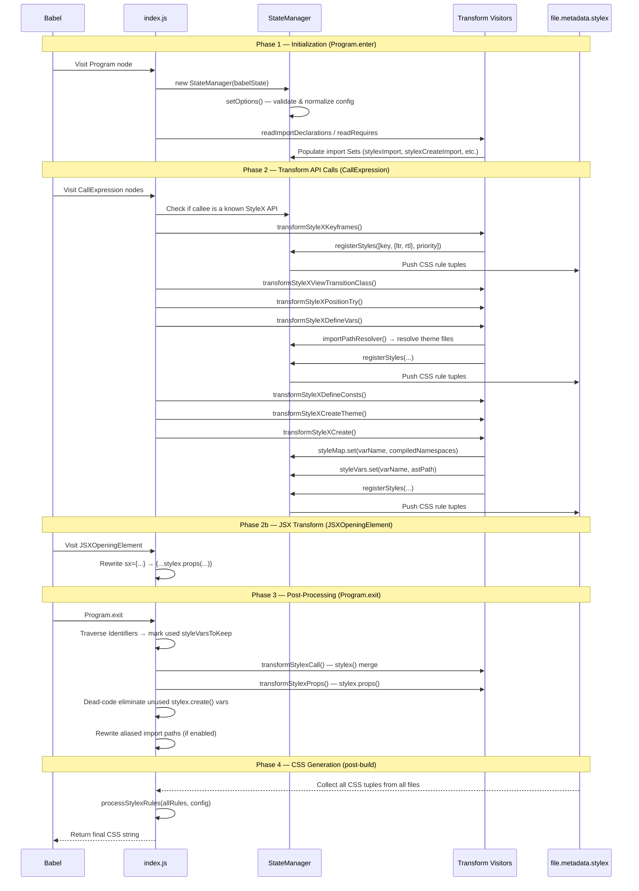

# StyleX Babel Plugin — Architecture & Data Flow

## High-Level Architecture

## Plugin Lifecycle — Data Flow

## StateManager Internal Structure

```mermaid
classDiagram
    class StateManager {
        -_state: PluginPass
        +importPaths: Set~string~
        +stylexImport: Set~string~
        +stylexPropsImport: Set~string~
        +stylexAttrsImport: Set~string~
        +stylexCreateImport: Set~string~
        +stylexIncludeImport: Set~string~
        +stylexFirstThatWorksImport: Set~string~
        +stylexKeyframesImport: Set~string~
        +stylexPositionTryImport: Set~string~
        +stylexDefineVarsImport: Set~string~
        +stylexDefineMarkerImport: Set~string~
        +stylexDefineConstsImport: Set~string~
        +stylexCreateThemeImport: Set~string~
        +stylexTypesImport: Set~string~
        +stylexViewTransitionClassImport: Set~string~
        +stylexDefaultMarkerImport: Set~string~
        +stylexWhenImport: Set~string~
        +stylexEnvImport: Set~string~
        +injectImportInserted: Identifier?
        +styleMap: Map~string, CompiledNamespaces~
        +styleVars: Map~string, NodePath~
        +styleVarsToKeep: Set~tuple~
        +inStyleXCreate: boolean
        +options: StyleXStateOptions
        +constructor(state)
        +setOptions(options) StyleXStateOptions
        +importPathResolver(importPath) ImportPathResolution
        +addStyle(style) void
        +registerStyles(styles, path) void
        +markComposedNamespace(memberExpression) void
        +getCanonicalFilePath(filePath) string
        +getPackageNameAndPath(filepath) tuple?
        +applyStylexEnv(identifiers) void
        +filename: string?
        +fileNameForHashing: string?
        +runtimeInjection: object?
        +isDev: boolean
        +isDebug: boolean
        +isTest: boolean
        +canReferenceTheme: boolean
        +metadata: object
        +cssVars: any
        +treeshakeCompensation: boolean
    }

    class StyleXStateOptions {
        +dev: boolean
        +debug: boolean
        +test: boolean
        +classNamePrefix: string
        +importSources: Array
        +runtimeInjection: string?
        +styleResolution: string
        +unstable_moduleResolution: ModuleResolution?
        +aliases: object?
        +rewriteAliases: boolean
        +treeshakeCompensation: boolean
        +enableDebugClassNames: boolean
        +enableDebugDataProp: boolean
        +enableDevClassNames: boolean
        +enableMinifiedKeys: boolean
        +enableMediaQueryOrder: boolean
        +enableLegacyValueFlipping: boolean
        +enableLogicalStylesPolyfill: boolean
        +enableLTRRTLComments: boolean
        +sxPropName: string | false
        +env: object
        +propertyValidationMode: string
        +debugFilePath: function?
    }

    class ModuleResolution {
        <<union>>
        commonJS: rootDir, themeFileExtension
        haste: themeFileExtension
        custom: filePathResolver, getCanonicalFilePath
        experimental_crossFileParsing: rootDir
    }

    StateManager --> StyleXStateOptions : options
    StyleXStateOptions --> ModuleResolution : unstable_moduleResolution
```

## CSS Rule Processing Pipeline (`processStylexRules`)

```mermaid
flowchart LR
    A["Input:\nArray of Rule tuples\n[key, {ltr, rtl?, constKey?, constVal?}, priority]"] --> B["Separate\nconstant vs\nnon-constant rules"]

    B --> C["Build constsMap\nResolve circular refs"]
    B --> D["Sort by priority\nthen property name"]

    C --> E["Inline const values\ninto CSS rules"]
    D --> E

    E --> F["Group by\npriority level\n(floor(pri/1000))"]

    F --> G{"useLayers?"}
    G -->|Yes| H["Wrap groups in\n@layer priority1, priority2..."]
    G -->|No| I{"legacyDisableLayers?"}
    I -->|No| J["Add :not(#\\#)\nspecificity bumps"]
    I -->|Yes| K["No specificity\nmodification"]

    H --> L["Handle RTL"]
    J --> L
    K --> L

    L --> M{"Has RTL\nvariant?"}
    M -->|Yes, enableLTRRTLComments| N["/* @ltr */ ... /* @rtl */\ncomment markers"]
    M -->|Yes, default| O["html:not([dir='rtl']) ...\nhtml[dir='rtl'] ..."]
    M -->|No| P["Single LTR rule"]

    N --> Q["Prepend logical\nfloat vars\n(if needed)"]
    O --> Q
    P --> Q

    Q --> R["Output:\nFinal CSS string"]

    style A fill:#2d3436,stroke:#636e72,color:#fff
    style R fill:#00b894,stroke:#00cec9,color:#fff
```

## File Dependency Graph

```mermaid
graph TD
    INDEX["index.js\n(Plugin Entry)"] --> SM["utils/state-manager.js\n(State & Config)"]
    INDEX --> IMP["visitors/imports.js"]
    INDEX --> VSC["visitors/stylex-create.js"]
    INDEX --> VSCT["visitors/stylex-create-theme.js"]
    INDEX --> VSDV["visitors/stylex-define-vars.js"]
    INDEX --> VSDC["visitors/stylex-define-consts.js"]
    INDEX --> VSK["visitors/stylex-keyframes.js"]
    INDEX --> VSPT["visitors/stylex-position-try.js"]
    INDEX --> VSMG["visitors/stylex-merge.js"]
    INDEX --> VSP["visitors/stylex-props.js"]
    INDEX --> VSVTC["visitors/stylex-view-transition-class.js"]
    INDEX --> VSDM["visitors/stylex-define-marker.js"]
    INDEX --> VSDFM["visitors/stylex-default-marker.js"]
    INDEX --> LES["shared/preprocess-rules/\nlegacy-expand-shorthands.js"]

    SM --> VAL["utils/validate.js"]
    SM --> EP["utils/evaluate-path.js"]
    SM --> AH["utils/ast-helpers.js"]
    SM --> SHARED["shared/index.js"]
    SM --> DO["shared/utils/default-options.js"]
    SM --> IMR["import-meta-resolve\n(external)"]

    IMP --> SM
    VSC --> SM
    VSCT --> SM
    VSDV --> SM
    VSDC --> SM
    VSK --> SM
    VSPT --> SM
    VSMG --> SM
    VSP --> SM
    VSVTC --> SM
    VSDM --> SM
    VSDFM --> SM

    style INDEX fill:#e17055,stroke:#d63031,color:#fff
    style SM fill:#0984e3,stroke:#74b9ff,color:#fff
    style IMP fill:#6c5ce7,stroke:#a29bfe,color:#fff
    style VSC fill:#6c5ce7,stroke:#a29bfe,color:#fff
    style VSCT fill:#6c5ce7,stroke:#a29bfe,color:#fff
    style VSDV fill:#6c5ce7,stroke:#a29bfe,color:#fff
    style VSDC fill:#6c5ce7,stroke:#a29bfe,color:#fff
    style VSK fill:#6c5ce7,stroke:#a29bfe,color:#fff
    style VSPT fill:#6c5ce7,stroke:#a29bfe,color:#fff
    style VSMG fill:#6c5ce7,stroke:#a29bfe,color:#fff
    style VSP fill:#6c5ce7,stroke:#a29bfe,color:#fff
    style VSVTC fill:#6c5ce7,stroke:#a29bfe,color:#fff
    style VSDM fill:#6c5ce7,stroke:#a29bfe,color:#fff
    style VSDFM fill:#6c5ce7,stroke:#a29bfe,color:#fff
    style LES fill:#fdcb6e,stroke:#e17055,color:#2d3436
    style VAL fill:#00cec9,stroke:#81ecec,color:#2d3436
    style EP fill:#00cec9,stroke:#81ecec,color:#2d3436
    style AH fill:#00cec9,stroke:#81ecec,color:#2d3436
    style SHARED fill:#00cec9,stroke:#81ecec,color:#2d3436
    style DO fill:#00cec9,stroke:#81ecec,color:#2d3436
    style IMR fill:#636e72,stroke:#b2bec3,color:#fff
```

